## 市场分析
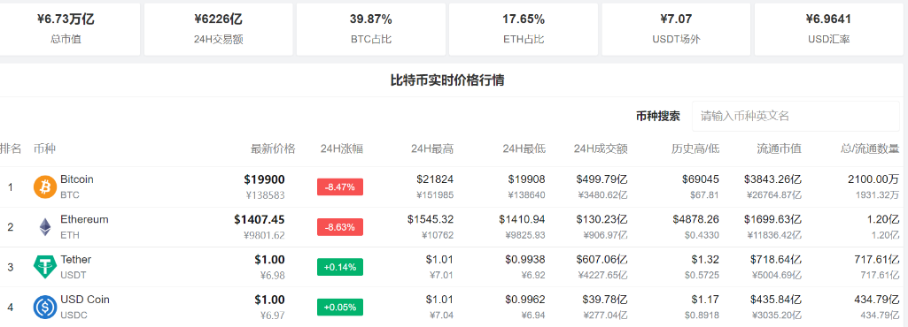

### BTC价格走势

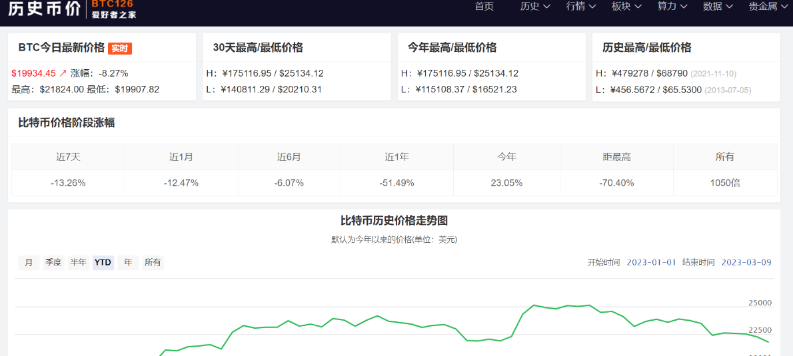

### ETH价格走势

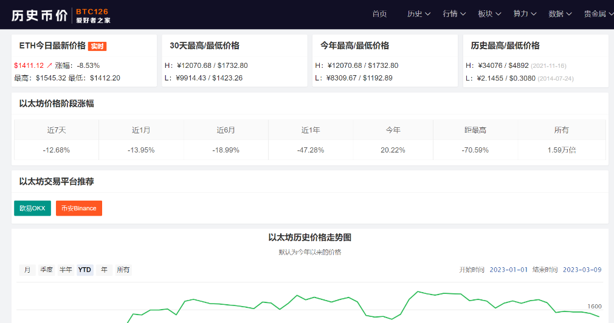

### 减半时间

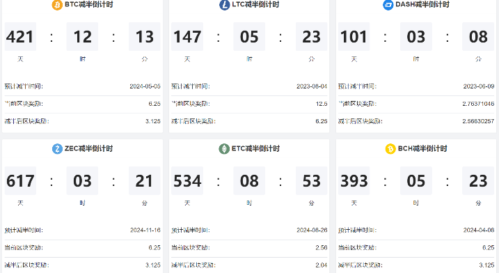

### 全网算力
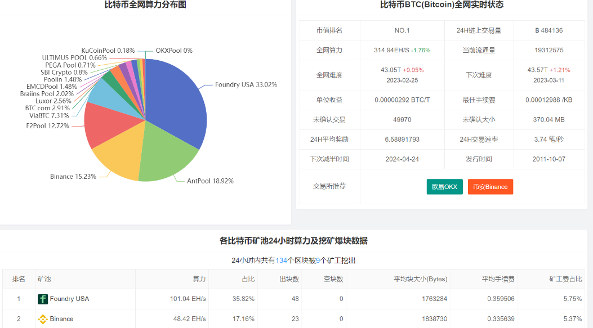

### 稳定币
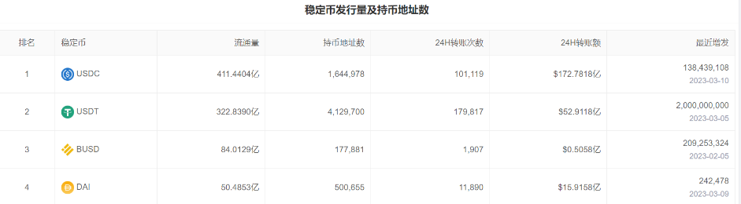

稳定币就是和某个标的保持稳定兑换比例的加密货币，稳定是指这种货币在一段时间内的价格不会有大幅波动，价格相对较为稳定。稳定币包括USDT、GUSD、USDC、PAX等等，是区块链技术诞生后才有的一个货币类别。稳定币的优点多数在于加密领域，在这个领域中稳定币充当了价值尺度的功能，在行情下跌时还能避险。
目前稳定币基本都是和美元挂钩，比值都为1：1，即每发行一个稳定币就要往银行账户里存入1美元

### 富豪持仓
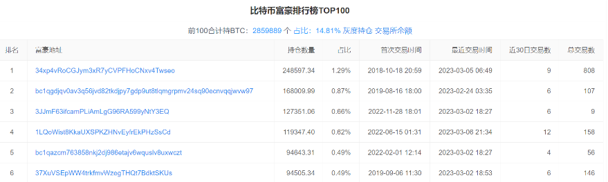

### 灰度持仓

灰度比特币信托持仓量代表在灰度信托(Grayscale Trust)发行的BTC信托基金中持有的BTC数量。 作为首个向SEC报告的加密货币投资工具，灰度信托的持仓量一定程度上反映了传统机构资金进入加密货币的资金量级。

灰度比特币信托简称GBTC，它是被动投资比特币的一种合规途径，客户可用现金或比特币向灰度购买若干GBTC份额，并在传统场外交易市场OTCQX上进行交易。

GrayScale公司的比特币信托基金是一种公开的比特币基金，为希望以证券形式进行比特币敞口的投资者而建立，而不需要购买和直接存储BTC。

## 板块概念
### 减半概念
减半币种是PoW挖矿所产生，比特币每4年减半一次，其它币种也是，每次减半都会带来价格的大幅波动。

### 以太坊上海升级
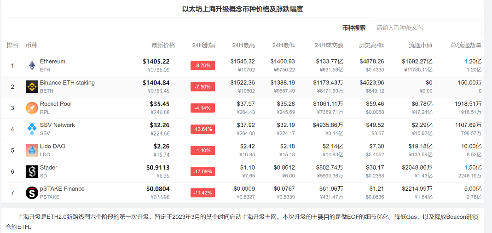

### 香港概念
香港概念通常指与香港相关的加密货币项目。例如，某些加密货币可能会在香港交易所上市，某些加密货币项目在香港设有分支机构，一些加密货币项目也可能将香港作为其主要市场或运营中心。近期香港证监会在一份咨询文件中表示，将允许个人投资者在证监会许可的交易所交易大市值代币，前提是知识测试、风险承受能力评估和合理的风险敞口限制等保障措施到位。
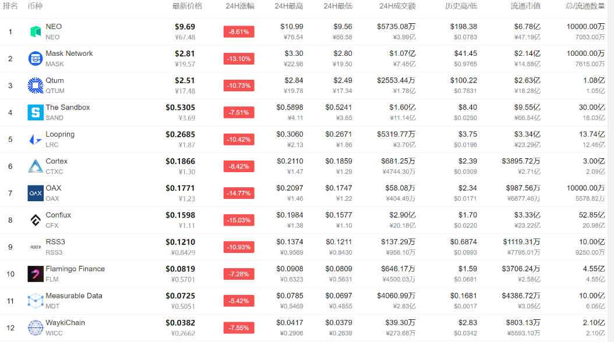

### layer2概念
Layer2协议通过将交易转移到底层以上的层级减少了对区块空间的需求，使交易速度更快、费率更低， 从而降低底层区块链的使用成本，将其网络应用辐射到更多用户。以太坊和比特币闪电网络就是典型的Layer2区块链项目。许多Layer2区块链扩容方案都发行了自己的代币激励参与共识或其他网络功能的持有者。
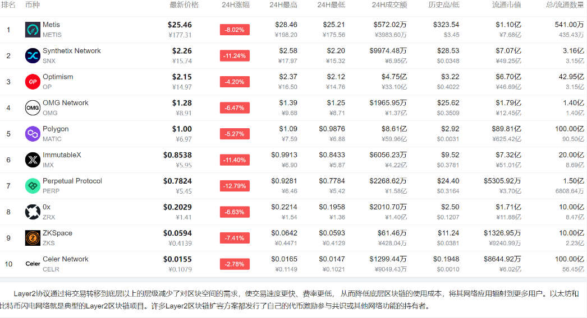

### 分布式存储
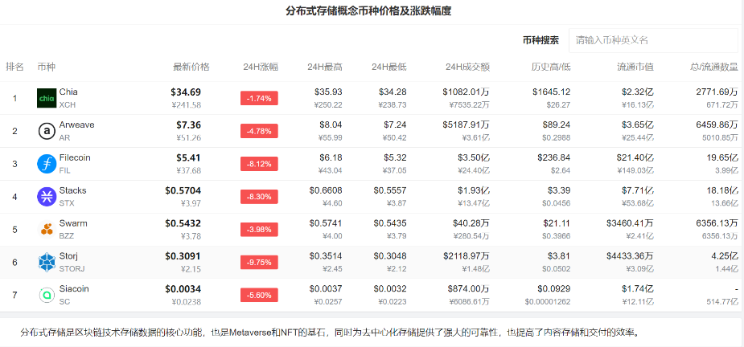

### Meme概念
狗狗币的营销使用了2013年流行的一个柴犬表情包。原图描绘的是一只品种为柴犬的狗狗，它的内心独白以漫画字体显示。 比如“how money”和“Very currency”。狗狗币的走红引起众多项目的效仿，诞生了一系列Meme币种，不同的币种采用不同品种柴犬形象作为他们的吉祥物。

## 交易所数据

### 交易所钱包余额

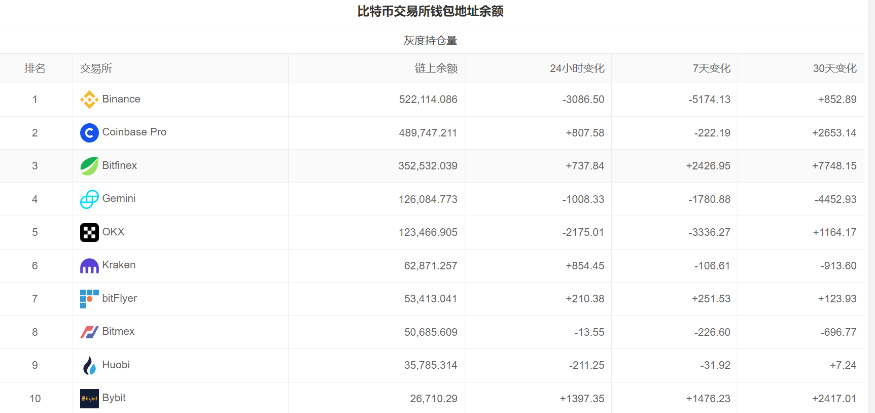

### 爆仓数据
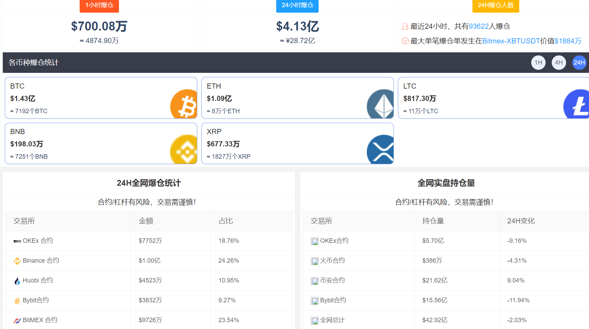

### 多空比例
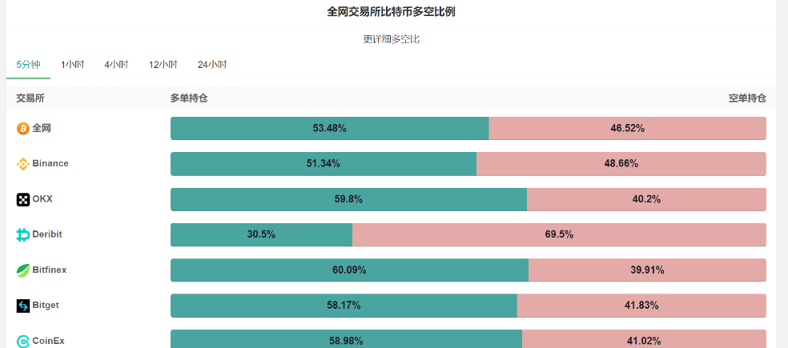