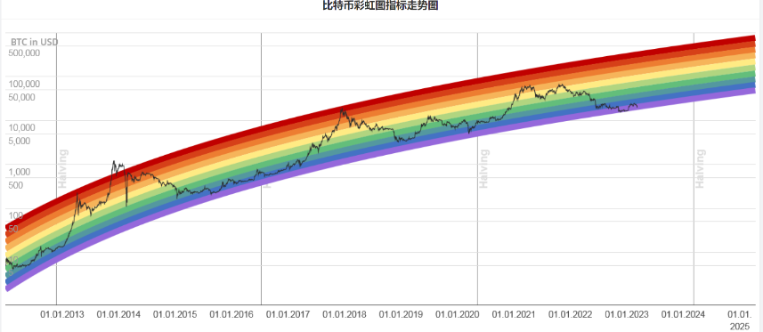
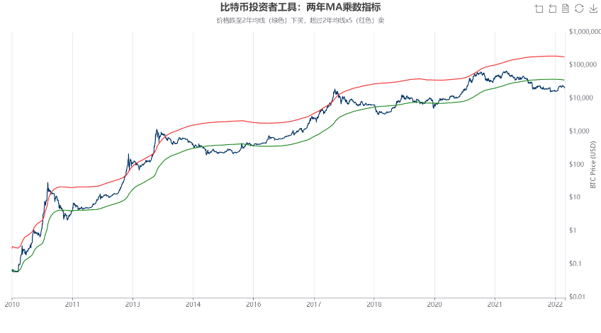
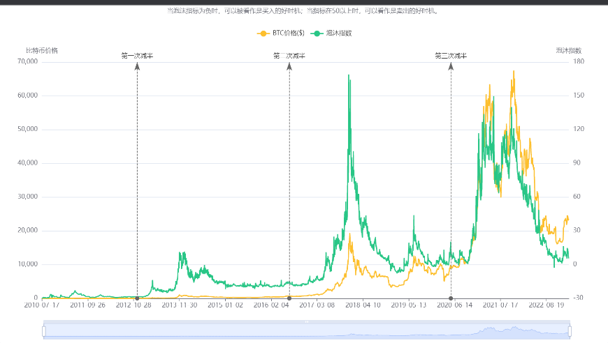
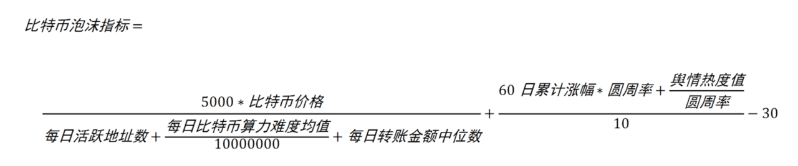
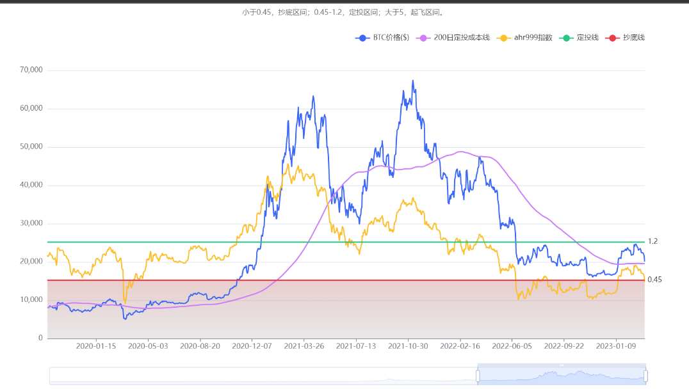
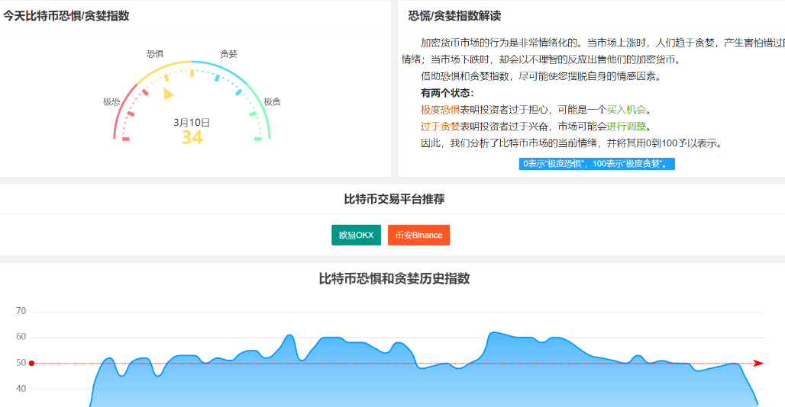

## 常用策略

### 彩虹图

彩虹图旨在成为一种观察长期价格变动的有趣方式，不考虑每日波动的“噪音”。色带遵循对数回归。该指数用于评估比特币所处于的价格情绪区间，判断合适的购买时机。

当币价位于彩虹带越靠近底部，代表投资价值越大；当币价越靠近彩虹带上方，代表泡沫越大，需注意风险。

该数据每日更新一次，更新时间为早上9:00(UTC+8)。

### 逃顶指标

比特币逃顶指标·抄底买入信号解读  
两年MA乘数指标旨在用作长期投资工具，它突出显示了在哪些时期买卖比特币会产生巨大回报。为此，它使用了2年移动平均值线2 Year Moving Average（等价730日线，绿色线），以及该移动平均值线的5倍乘积（红色线）。  

历史上：  
当价格跌至2年均线（绿线）以下时，是一个抄底买入信号，购买比特币会产生超额收益。 
当价格超过2年均线x5（红线）上时，是一个逃顶卖出信号，出售比特币会获得较大收益。

为什么会这样？  
随着比特币的采用，它会经历牛熊周期，由于市场参与者过度兴奋导致价格过度上涨；同样的，由于市场参与者过度悲观导致价格过度回落。识别和理解这些时期可能对长期投资者有利。该工具是突出显示这些时期的一种简单有效的方法。

指标作者：Philip Swift，2017年7月。

### 泡沫指标

比特币泡沫指标，由微博用户马超Terminal于2019年9月创建，计算公式如下：

主要由两部分构成：第一个大分式是比特币价格与链上数据（标准化处理之后）的比值，可以间接反映比特币价格相对链上数据的估值水平；第二个大分式由价格累计涨幅和舆情热度组成，间接反映比特币在市场和社区的综合表现。其他的一些参数主要是用于数值标准化的处理，以使得数据具有可加或可比性。

与囤币指标相比，泡沫指数综合考虑了有关比特币的诸多要素（链上数据、舆情数据等），有着异曲同工之效，二者在使用时可作为互补。

### 屯币指标

ahr999指数计算公式及说明  
在币圈的老玩家多少都听过“ahr999指数”。这是一位微博号为“ahr999” 的老玩家发明用于指导投资者囤比特币的指标。通俗地说，它是一个衡量币价是贵还是便宜的指标。按这个指数的计算方法，当ahr999指数低于0.45的时候，就是币价超级便宜，适合抄底，而当ahr999指数高于1.2的时候，就是币价有点小贵了，不太适合买入，指数在0.45和1.2之间都是适合定投的。  
ahr999指数=当前价的平方/200天成本/拟合预测价（小于0.45抄底，0.45和1.2之间定投，1.2和5之间等待起飞，只买不卖）。  
ahr999指数的重点在于0.45～1.2的囤币，而不是低于0.45的抄底。

ahr999x＝3/ahr999指数（ahr999x低于0.45为牛市顶部区域，注意此公式只能作为参考）

### 贪婪指数

当前指数仅适用于比特币，我们正在从以下五个来源收集数据。每个数据点的价值均与前一天相同，以可视化地显示加密货币市场情绪的变化。  

- 波动率（25%）  
获取比特币当前的波动率和最大值，并将其与最近30天和90天的相应平均值进行比较。我们认为，波动率的异常上升是市场恐惧的迹象。

- 市场动量/交易量（25%）  
当前的交易量和市场动能（与最近30/90天的平均值进行比较），并将这两个值放在一起。通常，当我们每天在积极市场中看到大量购买量时，可以得出结论，市场表现得过于贪婪/过于看涨。

- 社交媒体（15%）  
虽收集并计算reddit及twitter每种硬币在各种标签上的帖子（公开地，我们仅显示比特币的帖子），并检查它们在特定时间范围内的接收速度和交互次数。异常高的交互速度表明公众的兴趣与日俱增，这与贪婪的市场行为相对应。

- 市场调查（15%）  
每周在投票平台strawpoll.com上进行一次加密货币民意测验，并询问人们他们如何看待市场。通常，每次民意调查都会得到2000-3000个答卷，因此我们确实可以看到一组加密货币投资者的情绪。我们对这些结果并没有给予过多的关注，但是在我们的研究开始之时它是非常有用的。

- 主导地位（10%）  
主导地位类似于整个加密货币市场的市值份额。特别是对于比特币，我们认为比特币主导地位的上升是由于对过于投机性的另类货币投资的恐惧，因为比特币正越来越成为加密货币的避风港。另一方面，当比特币的主导地位下降时，人们变得更加贪婪，他们投资于风险更大的其它货币，梦想着在下一次大牛市中获得机会。无论如何，分析一种非比特币货币的主导地位，你可能会得出相反的结论，因为对另一种货币更感兴趣，可能会得出该货币看涨/贪婪行为的结论。

- Google趋势（10%）  
提取各种与比特币相关的搜索关键字的Google趋势数据，并对这些数字进行处理，尤其是搜索量的变化以及推荐的其他当前流行的搜索，将其用于指数。