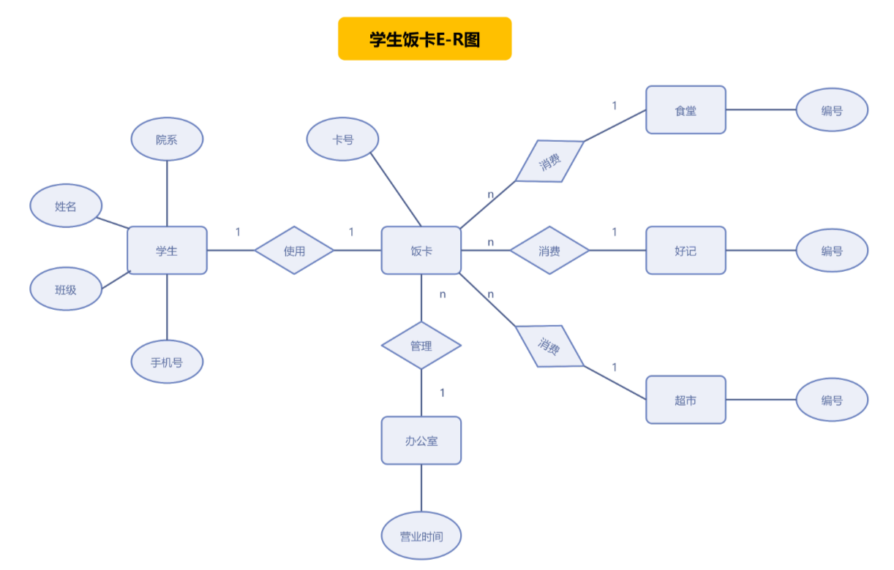

## ER图定义
ER图也称为实体关系图（Entity Relationship Diagram），提供了表示实体模型、属性和关系的方法，用例描述现实世界的概念模型。

### ER图基本元素
1. 实体  
实际问题中客观存在的并且可以相互区别的事物称为实体。实体是现实世界中的对象，可以具体到人，事，物。比如：上图中的饭卡、学生、办公室、食堂、超市。   
2. 属性  
实体所具有的某一个特性称为属性，在E-R图中属性用来描述实体。比如上图中的学生，可以用“姓名”、“院系”、“班级”、“手机号”进行属性描述。  
3. 实体集  
具有相同属性的实体的集合称为实体集。例如：全体学生就是一个实体集，（983573，李刚，男，2022/12/12）是学生实体集中的一个实体。
4. 键  
在描述实体集的所有属性中，可以唯一标识每个实体的属性称为键。键也是属于实体的属性，作为键的属性取值必须唯一且不能“空置”。比如：不重复的学生号，就可以作为学生的“键”.  
5. 实体型  
具有相同的特征和性质的实体一定有相同的属性，用实体名及其属性名集合来抽象和刻画同类实体称为实体型，其表示格式为：实体名（属性1，属性2，……）  
6. 联系   
世界上任何事物都不是孤立存在的，事物内部和事物之间都有联系的，实体之间的联系通常有3种类型：一对一联系，一对多联系，多对多联系。  

### ER图绘图规范
在ER图中有如下四个成分：
1. 矩形框：表示实体，在框中记入实体名
2. 菱形框：表示联系，在框中记入联系名。
3. 椭圆形框：表示实体或联系的属性，将属性名记入框中。对于主属性名，则在其名称下划一下划线。
4. 连线：实体与属性之间；实体与联系之间；联系与属性之间用直线相连，并在直线上标注联系的类型。  
（对于一对一联系，要在两个实体连线方向各写1； 对于一对多联系，要在一的一方写1，多的一方写N；对于多对多关系，则要在两个实体连线方向各写N，M。)  

### ER图的具体绘制流程
大致可以分为以下5步：
1. 确定所有的实体集合；
2. 选择实体集应包含的属性；
3. 确定实体集之间的联系；
4. 确定实体集的关键字，用下划线在属性上表明关键字的属性组合；
5. 确定联系的类型，在用线将表示联系的菱形框联系到实体集时，在线旁注明是1或n(多）来表示联系的类型。

### 绘制ER图的软件
- OfficeVisio、OfficeWord
- Edraw
- Enterprise Architect（EA）

### ER图属性语法
- 复合属性是多个属性的组合
- 多值属性是某个属性有多个不同的取值
- 派生属性是不保存在实体中的属性
- 可选属性是允许没有值的属性

### 实体关系语法

### ER图与用例图对比

## 数据库模型图

### 绘制数据库模型图工具
- Navicat
