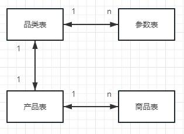

## 商品相关概念

### SPU和SKU
- SPU（Standard Producet Unit）  
SPU是标准产品单位，SPU描述一个产品的各种特性
- SKU（Stock Keeping Unit）  
SKU是库存进出计量的单位，SKU是物理上不可分割的最小存货单元。
- SPU的使用场景  
- SKU的使用场景  

### 参数与SKU的关系


## 商品表设计

### 商品信息表
```sql
CREATE TABLE `product_info` (
  `product_id` int unsigned NOT NULL AUTO_INCREMENT COMMENT '商品ID',
  `product_code` char(16) NOT NULL COMMENT '商品编码',
  `product_name` varchar(50) NOT NULL COMMENT '商品名称',
  `bar_code` varchar(50) NOT NULL COMMENT '国条码',
  `brand_id` int unsigned NOT NULL COMMENT '品牌表的ID',
  `one_category_id` smallint unsigned NOT NULL COMMENT '一级分类ID',
  `two_category_id` smallint unsigned NOT NULL COMMENT '二级分类ID',
  `three_category_id` smallint unsigned NOT NULL COMMENT '三级分类ID',
  `supplier_id` int unsigned NOT NULL COMMENT '商品的供应商id',
  `price` decimal(8,2) NOT NULL COMMENT '商品销售价格',
  `average_cost` decimal(18,2) NOT NULL COMMENT '商品加权平均成本',
  `publish_status` tinyint NOT NULL DEFAULT '0' COMMENT '上下架状态:0下架1上架',
  `audit_status` tinyint NOT NULL DEFAULT '0' COMMENT '审核状态:0未审核,1已审核',
  `weight` float DEFAULT NULL COMMENT '商品重量',
  `length` float DEFAULT NULL COMMENT '商品长度',
  `heigh` float DEFAULT NULL COMMENT '商品高度',
  `width` float DEFAULT NULL COMMENT '商品宽度',
  `color_type` enum('红','黄','蓝','黒') DEFAULT NULL,
  `production_date` datetime NOT NULL COMMENT '生产日期',
  `shelf_life` int NOT NULL COMMENT '商品有效期',
  `descript` text NOT NULL COMMENT '商品描述',
  `indate` timestamp NOT NULL DEFAULT CURRENT_TIMESTAMP COMMENT '商品录入时间',
  `modified_time` timestamp NOT NULL DEFAULT CURRENT_TIMESTAMP ON UPDATE CURRENT_TIMESTAMP COMMENT '最后修改时间',
  PRIMARY KEY (`product_id`)
) ENGINE=InnoDB AUTO_INCREMENT=1 COMMENT='商品信息表';
```

### 商品分类表
```sql
CREATE TABLE `product_category` (
  `category_id` smallint unsigned NOT NULL AUTO_INCREMENT COMMENT '分类ID',
  `category_name` varchar(10) NOT NULL COMMENT '分类名称',
  `category_code` varchar(10) NOT NULL COMMENT '分类编码',
  `parent_id` smallint unsigned NOT NULL DEFAULT '0' COMMENT '父分类ID',
  `category_level` tinyint NOT NULL DEFAULT '1' COMMENT '分类层级',
  `category_status` tinyint NOT NULL DEFAULT '1' COMMENT '分类状态',
  `modified_time` timestamp NOT NULL DEFAULT CURRENT_TIMESTAMP ON UPDATE CURRENT_TIMESTAMP COMMENT '最后修改时间',
  PRIMARY KEY (`category_id`)
) ENGINE=InnoDB AUTO_INCREMENT=1  COMMENT='商品分类表';
```


### 品牌信息表
```sql
CREATE TABLE `product_brand_info` (
  `brand_id` smallint unsigned NOT NULL AUTO_INCREMENT COMMENT '品牌ID',
  `brand_name` varchar(50) NOT NULL COMMENT '品牌名称',
  `telephone` varchar(50) NOT NULL COMMENT '联系电话',
  `brand_web` varchar(100) DEFAULT NULL COMMENT '品牌网站',
  `brand_logo` varchar(100) DEFAULT NULL COMMENT '品牌logo URL',
  `brand_desc` varchar(150) DEFAULT NULL COMMENT '品牌描述',
  `brand_status` tinyint NOT NULL DEFAULT '0' COMMENT '品牌状态,0禁用,1启用',
  `brand_order` tinyint NOT NULL DEFAULT '0' COMMENT '排序',
  `modified_time` timestamp NOT NULL DEFAULT CURRENT_TIMESTAMP ON UPDATE CURRENT_TIMESTAMP COMMENT '最后修改时间',
  PRIMARY KEY (`brand_id`)
) ENGINE=InnoDB AUTO_INCREMENT=1 COMMENT='品牌信息表';
```

### 商品评论表
```sql
CREATE TABLE `product_comment` (
  `comment_id` int unsigned NOT NULL AUTO_INCREMENT COMMENT '评论ID',
  `product_id` int unsigned NOT NULL COMMENT '商品ID',
  `order_id` bigint unsigned NOT NULL COMMENT '订单ID',
  `customer_id` int unsigned NOT NULL COMMENT '用户ID',
  `title` varchar(50) NOT NULL COMMENT '评论标题',
  `content` varchar(300) NOT NULL COMMENT '评论内容',
  `audit_status` tinyint NOT NULL COMMENT '审核状态:0未审核1已审核',
  `audit_time` timestamp NOT NULL DEFAULT CURRENT_TIMESTAMP ON UPDATE CURRENT_TIMESTAMP COMMENT '评论时间',
  `modified_time` timestamp NOT NULL DEFAULT CURRENT_TIMESTAMP ON UPDATE CURRENT_TIMESTAMP COMMENT '最后修改时间',
  PRIMARY KEY (`comment_id`)
) ENGINE=InnoDB  COMMENT='商品评论表';
```

### 商品图片信息表
```sql
CREATE TABLE `product_pic_info` (
  `product_pic_id` int unsigned NOT NULL AUTO_INCREMENT COMMENT '商品图片ID',
  `product_id` int unsigned NOT NULL COMMENT '商品ID',
  `pic_desc` varchar(50) DEFAULT NULL COMMENT '图片描述',
  `pic_url` varchar(200) NOT NULL COMMENT '图片URL',
  `is_master` tinyint NOT NULL DEFAULT '0' COMMENT '是否主图:0.非主图1.主图',
  `pic_order` tinyint NOT NULL DEFAULT '0' COMMENT '图片排序',
  `pic_status` tinyint NOT NULL DEFAULT '1' COMMENT '图片是否有效:0无效 1有效',
  `modified_time` timestamp NOT NULL DEFAULT CURRENT_TIMESTAMP ON UPDATE CURRENT_TIMESTAMP COMMENT '最后修改时间',
  PRIMARY KEY (`product_pic_id`)
) ENGINE=InnoDB DEFAULT CHARSET=utf8mb3 COMMENT='商品图片信息表';
```

### 供应商信息表
```sql
CREATE TABLE `product_supplier_info` (
  `supplier_id` int unsigned NOT NULL AUTO_INCREMENT COMMENT '供应商ID',
  `supplier_code` char(8) NOT NULL COMMENT '供应商编码',
  `supplier_name` char(50) NOT NULL COMMENT '供应商名称',
  `supplier_type` tinyint NOT NULL COMMENT '供应商类型:1.自营,2.平台',
  `link_man` varchar(10) NOT NULL COMMENT '供应商联系人',
  `phone_number` varchar(50) NOT NULL COMMENT '联系电话',
  `bank_name` varchar(50) NOT NULL COMMENT '供应商开户银行名称',
  `bank_account` varchar(50) NOT NULL COMMENT '银行账号',
  `address` varchar(200) NOT NULL COMMENT '供应商地址',
  `supplier_status` tinyint NOT NULL DEFAULT '0' COMMENT '状态:0禁用,1启用',
  `modified_time` timestamp NOT NULL DEFAULT CURRENT_TIMESTAMP ON UPDATE CURRENT_TIMESTAMP COMMENT '最后修改时间',
  PRIMARY KEY (`supplier_id`)
) ENGINE=InnoDB AUTO_INCREMENT=1 COMMENT='供应商信息表';
```


## 商品数据模型应用
### 电商网站
- 购物流程  
用户登录-> 选购商品-> 加购物车-> 检查库存-> 提交订单->  货到付款-> 发货  
-------------------------------------------------------|-> 订单付款-> 发货   

- 模块划分  
用户模块：完成用户注册和登录验证    
商品模块：前后台商品管理和浏览    
订单模块：订单及购物车的生成和管理  
仓配模块：仓库库存和物流的管理  
### 